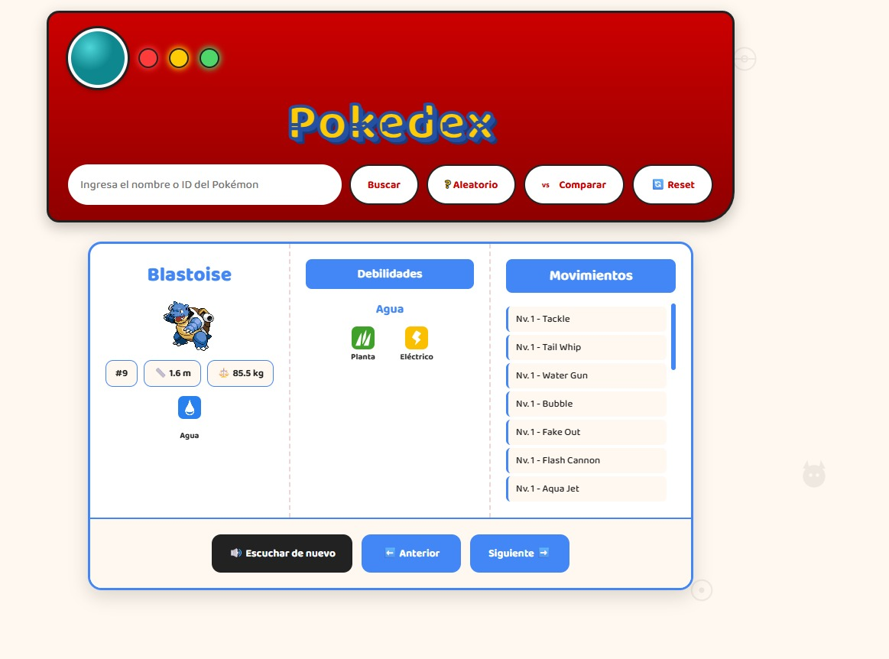
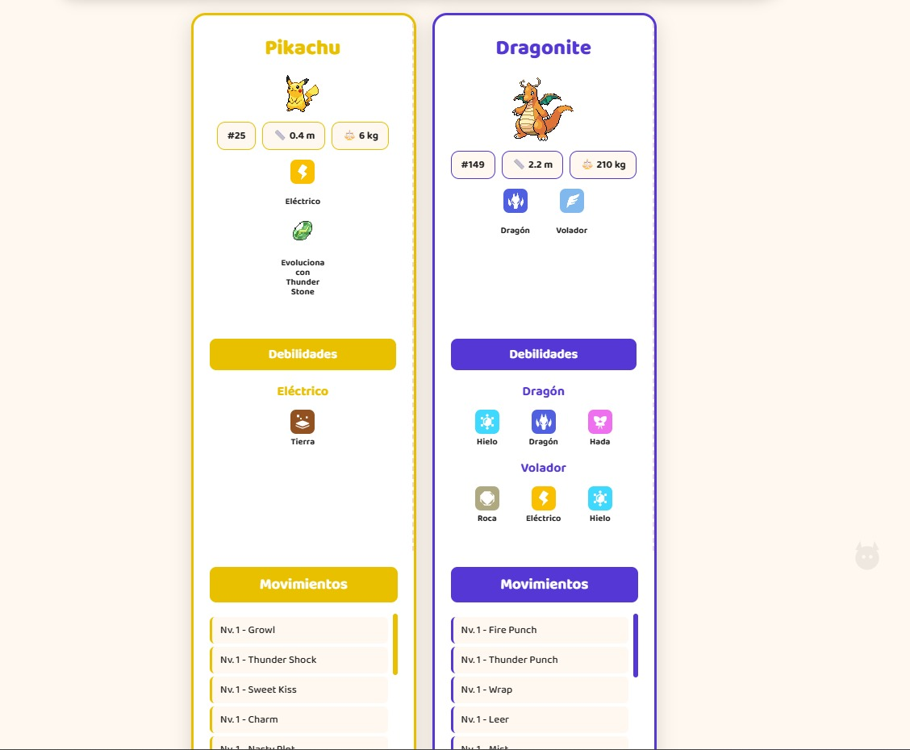
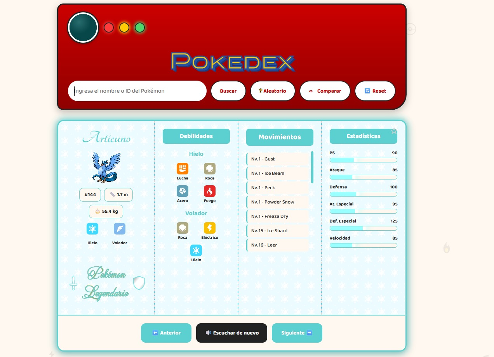
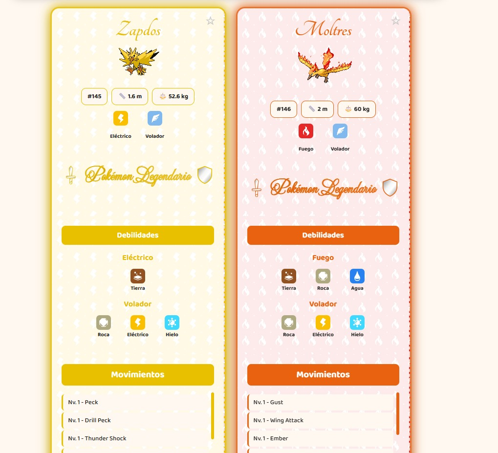
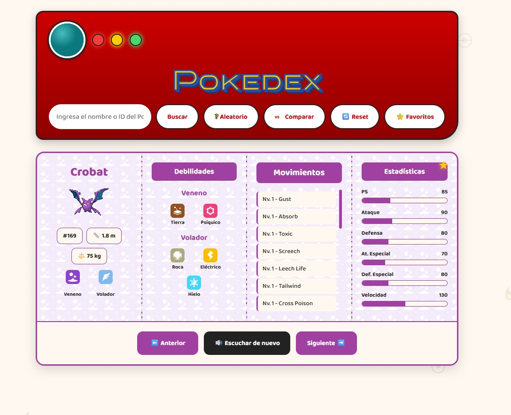

# 🔴 Pokédex
Buscador de Pokémon con datos en tiempo real y diseño inspirado en un dispositivo Pokédex, construido con **HTML, CSS y JavaScript puro (Vanilla JS)** — consume la [PokéAPI](https://pokeapi.co/) para mostrar información completa de cualquier Pokémon, con enfoque en datos útiles para jugadores competitivos: tipos, debilidades y movimientos. Incluye un modo de comparación para ver dos Pokémon lado a lado.

## 🚀 Demo en vivo
👉 [Ver la Pokédex funcionando](https://MaxVF97.github.io/Pokedex/)

## ✨ Funcionalidades
- 🔍 Búsqueda por nombre o número, con Enter o botón
- 🎲 Botón de Pokémon aleatorio
- ⭐ **Favoritos**: guarda hasta 10 Pokémon con un clic en la estrella de
  cada tarjeta; accede a ellos desde el botón "Favoritos" para verlos
  de nuevo o quitarlos, persistiendo entre sesiones
- ⚔️ **Modo comparación**: busca dos Pokémon y muestra sus tarjetas lado
  a lado, con:
  - Reproducción secuencial de sus gritos (2s de diferencia)
  - Sincronización automática de animaciones si ambos son legendarios
  - Alturas de cada sección igualadas entre ambas tarjetas
  - Al re-comparar, elige con un clic cuál tarjeta conservar —la
    elección es reversible hasta confirmarla, momento en que la
    descartada se desvanece gradualmente
  - Botón dinámico "Comparar" / "Cancelar" para entrar o salir del
    modo comparación en cualquier momento
- 🔊 Grito del Pokémon reproducido automáticamente, con botón para
  repetirlo (independiente por tarjeta, incluso en modo comparación)
- 🏷️ Tipo(s) del Pokémon, con ícono e identificación en español
- ⚔️ Debilidades por tipo, calculadas consultando la API en tiempo
  real, con íconos
- 📈 Lista de movimientos que aprende subiendo de nivel, ordenados,
  con scroll propio
- 📊 Estadísticas base (PS, Ataque, Defensa, Ataque/Defensa Especial,
  Velocidad) con barras de progreso; brillo pulsante en legendarios
- 💎 Piedra evolutiva (si aplica), con su ícono, en cualquier etapa de
  la cadena evolutiva
- ⭐ Aviso especial si el Pokémon es legendario, con marco, texto y
  estadísticas animadas
- ⬅️➡️ Navegación anterior/siguiente (en búsqueda individual)
- 🔄 Botón de reinicio para limpiar la búsqueda y el estado en un clic
- 🎨 Color de cada tarjeta y fondo temático por tipo, generados
  dinámicamente con los recursos de la propia API
- 💡 Estados visuales del dispositivo: LEDs con colores diferenciados
  (azul buscando, rojo error, verde reset) y ventanas emergentes para
  cada situación
- 📱 Diseño responsivo: se adapta a computadora, tablet y celular, en
  cualquier orientación
- 🚫 Manejo de errores si el nombre no existe o el campo está vacío,
  con mensajes diferenciados
- 🔤 Nombre siempre capitalizado, sin importar cómo se escriba
- Secuencia de sonidos: al agregar el 2do Pokémon, suena su grito de inmediato; 5s después suena el 1ro, y 2s más tarde el 2do otra vez, para escuchar bien ambos gritos antes de decidir
## 🛠️ Tecnologías
Construido con **HTML, CSS y JavaScript puro**, sin frameworks ni librerías. Consume dos APIs públicas: la [PokéAPI](https://pokeapi.co/) para datos de Pokémon, tipos, especies e ítems, y el repositorio open-source [PokeAPI/sprites](https://github.com/PokeAPI/sprites) para íconos de tipo, ítems y sprites animados.

## 📚 Lo que practiqué en este proyecto
- Peticiones a APIs externas con `fetch`, `async`/`await` y manejo de promesas
- Encadenamiento de múltiples peticiones dependientes entre sí
- `for...of` para recorrer arrays de forma asíncrona (a diferencia de `.forEach()`)
- Recursión, para recorrer la cadena evolutiva de cada Pokémon
- Métodos de array: `.filter()`, `.map()`, `.sort()`, `.some()`, `.find()`, `.forEach()`
- Manejo de errores con `try`/`catch`
- Manipulación de strings: `.charAt()`, `.slice()`, `.split()`, template literals
- Refactor de lógica duplicada en funciones reutilizables y componibles (separar la obtención de datos de la generación de HTML)
- Parámetros opcionales y operador ternario para generar variantes de una misma plantilla HTML
- Manejo de estado con variables globales, incluyendo una máquina de estados simple para el modo comparación
- `data-*` attributes y `event.target` para delegación de eventos en contenido dinámico con múltiples instancias
- `setTimeout` para secuenciar acciones en el tiempo (reproducción de sonidos en orden)
- Medición y ajuste del DOM en tiempo de ejecución (`offsetHeight`) para igualar alturas entre elementos generados dinámicamente
- Manejo de errores de carga de imágenes con el evento `onerror`
- CSS Grid y Flexbox para layouts responsivos de varias columnas
- Variables CSS (custom properties) actualizadas dinámicamente desde JavaScript
- Animaciones con `@keyframes`, incluyendo animaciones sincronizadas entre múltiples elementos

## 📸 Vista previa

**Búsqueda individual**

**Modo comparación**

**Pokémon legendario**

**Modo comparación LEGENDARIO!**

**Favoritos**

---
Proyecto hecho como parte de mi aprendizaje de desarrollo web front-end.
