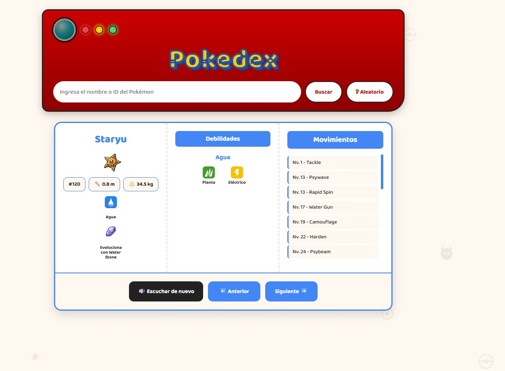

# 🔴 Pokédex

Buscador de Pokémon con datos en tiempo real, construido con **HTML, CSS y JavaScript puro (Vanilla JS)** — consume la [PokéAPI](https://pokeapi.co/) para mostrar información completa de cualquier Pokémon, con enfoque en datos útiles para jugadores competitivos: tipos, debilidades y movimientos.

## 🚀 Demo en vivo

👉 [Ver la Pokédex funcionando](https://MaxVF97.github.io/Pokedex/)

## ✨ Funcionalidades

- 🔍 Búsqueda por nombre o número, con Enter o botón
- 🎲 Botón de Pokémon aleatorio
- 🔊 Grito del Pokémon reproducido automáticamente, con botón para repetirlo
- 🏷️ Tipo(s) del Pokémon, con ícono e identificación en español
- ⚔️ Debilidades por tipo, calculadas consultando la API en tiempo real, con íconos
- 📈 Lista de movimientos que aprende subiendo de nivel, ordenados
- ⭐ Aviso especial si el Pokémon es legendario
- ⬅️➡️ Navegación anterior/siguiente dentro de la Pokédex
- 🚫 Manejo de errores si el nombre no existe
- 🔤 Nombre siempre capitalizado, sin importar cómo se escriba

## 🛠️ Tecnologías

Construido con **HTML, CSS y JavaScript puro**, sin frameworks ni librerías. Consume dos APIs públicas: la [PokéAPI](https://pokeapi.co/) para datos de Pokémon y tipos, y el repositorio open-source [PokeAPI/sprites](https://github.com/PokeAPI/sprites) para íconos de tipo.

## 📚 Lo que practiqué en este proyecto

- Peticiones a APIs externas con `fetch`, `async`/`await` y manejo de promesas
- Encadenamiento de múltiples peticiones dependientes entre sí
- `for...of` para recorrer arrays de forma asíncrona (a diferencia de `.forEach()`)
- Métodos de array: `.filter()`, `.map()`, `.sort()`, `.some()`, `.find()`
- Manejo de errores con `try`/`catch`
- Manipulación de strings: `.charAt()`, `.slice()`, `.split()`, template literals
- Delegación de eventos para contenido generado dinámicamente
- Variables globales para mantener estado entre búsquedas

## 📸 Vista previa

---

Proyecto hecho como parte de mi aprendizaje de desarrollo web front-end.
